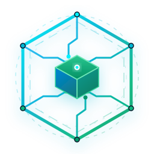

# 全端全栈技术选型矩阵与架构决策蓝图

<p align="center">
  
</p>

<p align="center">
  <b>企业级 34 个垂直领域的现代化全端全栈技术选型全景矩阵 · 架构决策与生产实践指南</b>
</p>

<p align="center">
  <a href="https://vitepress.dev"></a>
  <a href="https://vuejs.org"></a>
  <a href="https://react.dev"></a>
  <a href="https://flutter.dev"></a>
  <a href="https://spring.io/projects/spring-boot"></a>
  <a href="https://kubernetes.io"></a>
  <a href="https://unocss.dev"></a>
  <a href="./LICENSE"></a>
</p>

---

## 📖 项目简介

本项目旨在为现代软件研发团队提供一套**标准、权威、具备极强工业实操性**的数字化全端全栈技术选型方案。项目彻底打破“前端、后端、嵌入式、算法各自为政”的技术孤岛，系统性收敛了从用户交互端到核心业务、工业物联网、数据湖仓、AI大模型及云原生基础设施的 **34 个垂直业务领域**。

每个领域均提供：
* ⚡ **双生架构模式**：兼顾开箱即用的“企业级敏捷脚手架（模式 A）”与极致可控的“第一方自研组合（模式 B）”；
* 📋 **技术栈职责清单**：标明版本范围与各依赖的分层职责；
* 💡 **核心选型考量**：阐述为什么选它、解决了什么痛点及竞品对比；
* 🛡️ **生产红线与反模式清单**：提供可执行的安全防护、并发治理与性能底线。

---

## 🗺️ 架构领域矩阵索引 (34 垂直领域)

### 📱 1. [多端客户端与表现层](./docs/client/index.md) (`docs/client/`)
* [Web 业务管理系统 (Vue 3 + Element Plus)](./docs/client/web-management.md)
* [品牌官网与营销落地页 (React 19 + Tailwind v4 + shadcn/ui)](./docs/client/marketing-site.md)
* [多端小程序 (uni-app + Wot Design Uni)](./docs/client/cross-miniapp.md)
* [微信原生小程序 (TypeScript + TDesign + Skyline)](./docs/client/wechat-native.md)
* [独立移动 APP (Flutter 移动专属: iOS / Android)](./docs/client/flutter-mobile.md)
* [独立 PC 桌面端 (Flutter 桌面专属: Windows / macOS / Linux)](./docs/client/flutter-desktop.md)
* [现代化 PC 桌面端 (Tauri 2.0 + Rust + Web 前端)](./docs/client/tauri-desktop.md)
* [移动 & PC 全端通用端 (Flutter 5 端同构: Mobile & Desktop)](./docs/client/flutter-universal.md)
* [独立移动端 H5 (Vue 3 + Vant 4)](./docs/client/mobile-h5.md)
* [数据可视化大屏 (Vue 3 + autofit.js + ECharts 5)](./docs/client/datav-screen.md)
* [Web 3D 渲染与数字孪生 (Three.js 双引擎分流)](./docs/client/web-3d-digital-twin.md)
* [Web 文档系统 (VitePress)](./docs/client/web-docs-vitepress.md)

### ⚙️ 2. [核心业务与脚本自动化](./docs/backend/index.md) (`docs/backend/`)
* [核心业务后端 (Spring Boot / Cloud 6.X 双生矩阵)](./docs/backend/core-backend.md)
* [数据采集、办公流与自动化脚本工具 (Python uv + Playwright)](./docs/backend/python-automation.md)

### 🏭 3. [工业物联与专业图形](./docs/iot-graphics/index.md) (`docs/iot-graphics/`)
* [PC 桌面端专业 3D 渲染与数字孪生 (UE5 / Unity 6 双引擎)](./docs/iot-graphics/desktop-3d-simulation.md)
* [物联网边缘网关与嵌入式微服务 (Linux 边缘盒 / MCU 固件双模)](./docs/iot-graphics/iot-edge-mcu.md)
* [工业物联网 PLC 通信协议与 SCADA 智能数采 (PLC4X / Snap7 / Neuron)](./docs/iot-graphics/industrial-plc-scada.md)
* [嵌入式微型屏 GUI 与工业触控 HMI (LVGL / Slint)](./docs/iot-graphics/embedded-gui-hmi.md)
* [跨平台轻量游戏开发与互动营销小游戏 (Cocos Creator / Godot 4)](./docs/iot-graphics/lightweight-game-engine.md)

### 🗄️ 4. [系统底座与数据湖仓](./docs/data-infra/index.md) (`docs/data-infra/`)
* [服务器操作系统与基础服务矩阵 (Linux OS & Host Services)](./docs/data-infra/linux-services.md)
* [企业级数据存储与分布式中间件矩阵 (MySQL / PG / Doris / RustFS)](./docs/data-infra/data-middleware.md)
* [大数据实时流批一体与现代数据湖仓架构 (Flink + Paimon / Spark + Iceberg)](./docs/data-infra/bigdata-lakehouse.md)
* [知识图谱图数据库与复杂关联网络挖掘 (Neo4j / NebulaGraph GraphRAG)](./docs/data-infra/knowledge-graph.md)

### 🤖 5. [AI算法与多模态感知](./docs/ai-speech/index.md) (`docs/ai-speech/`)
* [AI Agent 微服务与大模型工作流 (FastAPI + LangGraph + LiteLLM)](./docs/ai-speech/ai-agents.md)
* [计算机视觉与智能图像识别 (YOLO11 + PaddleOCR)](./docs/ai-speech/computer-vision-ocr.md)
* [AI 大模型算法研发与微调评测矩阵 (PEFT / DeepSpeed / GRPO)](./docs/ai-speech/llm-finetuning-mlops.md)
* [智能语音识别与音频合成微服务 (SenseVoice + CosyVoice)](./docs/ai-speech/speech-ai-asr-tts.md)

### ☁️ 6. [云原生质量与安全韧性](./docs/cloud-reliability/index.md) (`docs/cloud-reliability/`)
* [Linux 集群运维编排与自动化部署工具 (Go Cluster Ops)](./docs/cloud-reliability/linux-cluster-ops.md)
* [云原生容器集群编排与 GitOps 持续交付 (K8s 1.30+ + Cilium + ArgoCD)](./docs/cloud-reliability/kubernetes-gitops.md)
* [音视频实时流媒体 GB28181 与 WebRTC 通信 (ZLMediaKit + LiveKit)](./docs/cloud-reliability/media-streaming-webrtc.md)
* [企业级统一身份认证 IAM 与网络安全防护 (Keycloak + 雷池 WAF + Vault)](./docs/cloud-reliability/security-iam.md)
* [全链路负载压测流量回放与混沌高可用演练 (k6 + GoReplay + Chaos Mesh)](./docs/cloud-reliability/performance-chaos.md)
* [空间地理信息系统 WebGIS 与遥感空间服务 (PostGIS + GeoServer + CesiumJS)](./docs/cloud-reliability/spatial-webgis.md)
* [云原生统一可观测性与全景 APM 监控中枢 (OpenTelemetry + VictoriaMetrics)](./docs/cloud-reliability/observability-apm.md)

---

## 🚀 本地开发与体验

本项目采用 **pnpm** 作为标准包管理器。

### 1. 安装依赖
```bash
pnpm install
```

### 2. 启动本地文档开发服务器
```bash
pnpm dev
# 或
pnpm docs:dev
```
启动后在浏览器中访问控制台输出的本地地址（默认 `http://localhost:5173`）即可体验带本地离线搜索、专注模式、Markmap 导图的完整站点。

### 3. 生产环境构建与预览
```bash
# 静态构建
pnpm build

# 本地预览产物
pnpm preview
```

---

## 📂 工程目录结构

```text
fullstack-matrix/
├── docs/                        # 文档核心源码目录
│   ├── .vitepress/              # VitePress 站点核心配置与 Zenith 增强主题
│   │   ├── config.ts            # 全局配置（导航、侧边栏、搜索、Markdown 插件）
│   │   ├── theme/               # 主题扩展、组件库与 UnoCSS 样式
│   │   └── utils/               # 自动侧边栏与工具脚本
│   ├── public/                  # 静态公共资源（SVG 矢量图标等）
│   ├── client/                  # 1. 多端客户端与表现层 (12 篇)
│   ├── backend/                 # 2. 核心业务与脚本自动化 (2 篇)
│   ├── iot-graphics/            # 3. 工业物联与专业图形 (5 篇)
│   ├── data-infra/              # 4. 系统底座与数据湖仓 (4 篇)
│   ├── ai-speech/               # 5. AI算法与多模态感知 (4 篇)
│   ├── cloud-reliability/       # 6. 云原生质量与安全韧性 (7 篇)
│   ├── overview.md              # 全栈速查总览表 (Section 00)
│   └── index.md                 # 现代化旗舰 Landing Page 首页
├── package.json                 # 项目依赖与 Scripts 脚本
├── tsconfig.json                # TypeScript 配置文件
├── uno.config.ts                # UnoCSS 原子化与图标配置
└── README.md                    # 本文件
```

---

## 📄 开源许可证

本项目基于 [MIT License](./LICENSE) 协议开源。
